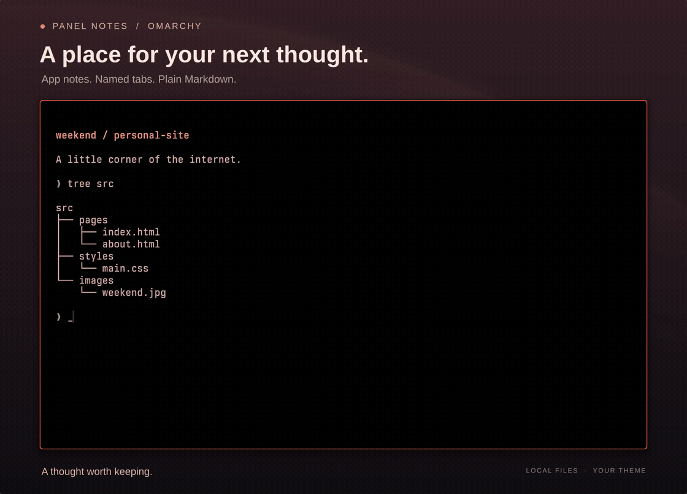

# Panel Notes

Markdown notes for the app you're using. Open notes over a window, jot something
down, and press **Escape** to return to your work.

Each app has an **App** note and named tabs for things like Ideas, Research, or
To-do. Notes are shared across windows of the same app and persist across restarts.



[View screenshot](preview.png)

- Write Markdown with autosave and a formatted preview.
- Paste images or capture the current window with **Snapshot**.
- Add, rename, and remove named tabs. Find saved notes in **All notes**.
- Use your current Omarchy theme, with a subtle opening and closing animation.
- Open the same Markdown file in **Omawrite** for external editing.

Notes belong to the app and the tab you choose. Browser pages, terminal
directories, and open documents don't automatically change your notes.

## Requirements

Omarchy 4 with the Quickshell shell and Lua-based Hyprland configuration,
Python 3, and `wl-clipboard`. Omawrite is optional.

## Install

```sh
omarchy plugin add https://github.com/rblalock/omarchy-panel-notes.git --enable
```

Allow a few seconds to load, then open notes for the focused app:

```sh
omarchy-shell panel-notes toggle
```

### Keyboard shortcut

To set up **Super+Alt+N** and the optional `panel-notes` command:

```sh
~/.config/omarchy/plugins/rblalock.panel-notes/scripts/setup
```

The helper backs up changed keybindings and checks for conflicts. To choose your
own shortcut instead, add a binding in `~/.config/hypr/bindings.lua`:

```lua
o.bind("SUPER + ALT + N", "Panel Notes", "omarchy-shell panel-notes toggle")
```

### App launcher

Optionally add **Panel Notes** to your app launcher. It opens All notes:

```sh
mkdir -p ~/.local/share/applications
cp ~/.config/omarchy/plugins/rblalock.panel-notes/rblalock.panel-notes.desktop ~/.local/share/applications/
```

## Using notes

Click **+** or press **Ctrl+T** to add a named tab. Right-click a tab or press
**F2** to rename it. Removing a tab keeps its note in **All notes**; add the same
name again to restore it.

Use **Ctrl+Shift+P** to switch between editing and preview, **Ctrl+Shift+S** for
a snapshot, and **Ctrl+Shift+F** to search all notes. Hover buttons to see their
shortcuts, or press **F1** for the full guide.

Notes save to **`~/Documents/Panel Notes`** by default. Choose a different folder
in Settings. Notes are ordinary Markdown files with image assets alongside them.
Back up the collection and `~/.local/state/panel-notes` to preserve tab organization
and recovery drafts too. Removing the plugin keeps your notes.

See the [usage guide](docs/usage.md) for all shortcuts, storage, recovery, and troubleshooting.

## Keyboard shortcuts

Hover buttons for shortcuts; **F1** opens the full guide.

| Action | Shortcut |
|---|---|
| Open / toggle notes (optional binding) | Super+Alt+N |
| Close and return to source | Escape |
| Add / rename tab | Ctrl+T / F2 |
| Remove selected named tab, keep note | Ctrl+Shift+Delete |
| Select tab / next / previous | Alt+1…9 / Ctrl+Tab / Ctrl+Shift+Tab |
| Focus editor / search all notes | Ctrl+E / Ctrl+Shift+F |
| Preview / edit | Ctrl+Shift+P |
| Snapshot source window | Ctrl+Shift+S |
| Open in Omawrite / reload external edits | Ctrl+O |
| Settings / help | Ctrl+, / F1 |
| Bold / italic / paste text or image | Ctrl+B / Ctrl+I / Ctrl+V |
| Retry saving after an error | Ctrl+S |

In Add/Rename, Enter saves the name and Escape cancels. Normal note edits autosave.

## Commands

These commands work without the optional shortcut setup:

```sh
omarchy-shell panel-notes toggle   # Notes for the focused app
omarchy-shell panel-notes library  # Search all notes
omarchy-shell panel-notes hide     # Close notes
omarchy-shell panel-notes inspect  # Runtime information
```

## Update

Wait for **Saved**, close notes, then run:

```sh
omarchy plugin update rblalock.panel-notes
omarchy restart shell
```

## Disable or remove

```sh
omarchy plugin disable rblalock.panel-notes
omarchy plugin enable rblalock.panel-notes
omarchy plugin remove rblalock.panel-notes
```

If you used the shortcut setup helper, use this **instead of the remove command**
to also remove its shortcut and `panel-notes` command:

```sh
~/.config/omarchy/plugins/rblalock.panel-notes/scripts/remove
```

Remove any manually added keybinding yourself. If you added the app launcher:

```sh
rm -f ~/.local/share/applications/rblalock.panel-notes.desktop
```

## Contributing

See [CONTRIBUTING.md](CONTRIBUTING.md) for the code map and development checks.
Report bugs or suggest improvements through [GitHub Issues](https://github.com/rblalock/omarchy-panel-notes/issues).

MIT licensed. Inspired by [Flip](https://flip.pylondev.com/).
