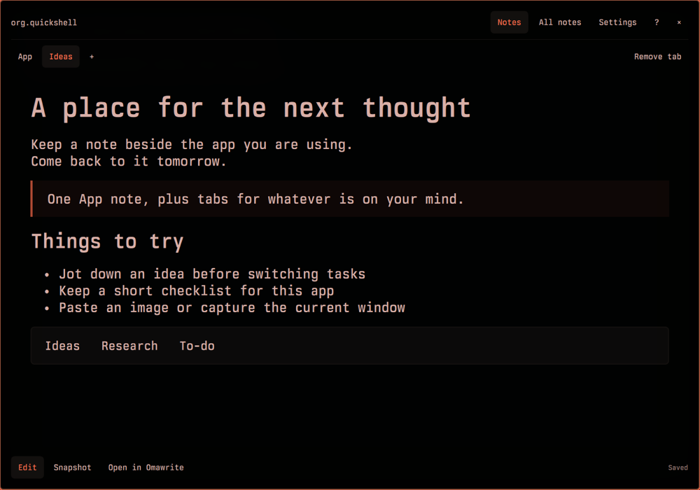

# Panel Notes

Markdown notes for the app you're using. Open a notes surface over its window,
write something, then press **Escape** to return. Add an optional **Super+Alt+N**
shortcut for quick access.

Each app has an **App** note and any named tabs you add: Ideas, Research, To-do,
or whatever fits. Notes persist across windows and restarts. They stay visible
while you work in an adjacent app.



- Plain Markdown files, autosave, search, and a formatted preview.
- Paste images or capture the source window with **Snapshot**.
- Right-click a named tab to rename it; removing a tab keeps its note.
- Current Omarchy theme colors and a subtle 200 ms opening/closing animation.
- Optional **Open in Omawrite** for editing the same Markdown file externally.

Panel Notes does **not** detect browser tabs, terminal directories, documents,
or Slack channels. Switching a tab inside an app does not switch your notes.

## Requirements

The **Omarchy 4 shell with Lua-based Hyprland configuration**, Python 3, Quickshell,
and `wl-clipboard`. Tested locally with Omarchy 4.0.3, Quickshell 0.3.1,
Hyprland 0.56.2 and Qt 6.11.2. Older Omarchy/Hyprland configurations are not supported.
Omawrite is optional; Node, `grim`, and `wtype` are only needed for development checks.

## Install

```sh
omarchy plugin add https://github.com/rblalock/omarchy-panel-notes.git --enable
```

Allow a few seconds for the shell to load the plugin after installation.
Focus an app, then open its notes:

```sh
omarchy-shell panel-notes toggle
```

For keyboard access, add this optional binding in `~/.config/hypr/bindings.lua`:

```lua
o.bind("SUPER + ALT + N", "Panel Notes", "omarchy-shell panel-notes toggle")
```

Choose another combination if it is already in use. Installation does not edit
Hyprland configuration, set up other apps, or change your Bash/Zsh configuration.

If you prefer automatic shortcut setup, this optional helper adds the binding
and a `panel-notes` command. It backs up changed keybindings, refuses conflicts,
and is safe to repeat:

```sh
~/.config/omarchy/plugins/rblalock.panel-notes/scripts/setup
```

### App launcher

Optionally make **Panel Notes** available in the app launcher. It opens All notes:

```sh
mkdir -p ~/.local/share/applications
cp ~/.config/omarchy/plugins/rblalock.panel-notes/rblalock.panel-notes.desktop ~/.local/share/applications/
```

### Moving from the initial plugin ID

If you installed the initial `io.github.rblalock.panel-notes` version, wait for
**Saved**, then remove that installation before installing the renamed plugin.
Run this before updating the old checkout:

```sh
~/.config/omarchy/plugins/io.github.rblalock.panel-notes/scripts/remove
omarchy plugin add https://github.com/rblalock/omarchy-panel-notes.git --enable
omarchy restart shell
```

Your notes, tab names, and collection settings are retained. Run the optional
shortcut setup again if you used it. If you installed the old desktop launcher,
remove `~/.local/share/applications/io.github.rblalock.panel-notes.desktop` and
copy the renamed launcher using the instructions above.

### Commands

These work without the optional setup helper:

```sh
omarchy-shell panel-notes toggle   # Notes for the focused app
omarchy-shell panel-notes library  # Search all notes
omarchy-shell panel-notes hide     # Close notes
omarchy-shell panel-notes inspect  # Loaded version and runtime state
```

## Tabs and notes

Click **+** or press **Ctrl+T**, enter a name, and press Enter. Each named tab
contains one note under that app. The same name in two apps gives you separate notes.
Names are ordinary labels, not file paths or links.

Right-click a named tab, or select it and press **F2**, to rename it. The note,
images, and file location stay the same. Names must be unique within an app,
including notes retained after removing a tab. Matching ignores case and surrounding
spaces. The default App tab cannot be renamed or removed.

**Remove tab** removes the selected tab from the app; its note remains searchable
in **All notes**. Add its current name again to bring it back.

## Keyboard shortcuts

Hover buttons for shortcuts; **F1** opens the full guide.

| Action | Shortcut |
|---|---|
| Open / toggle notes (optional binding) | Super+Alt+N |
| Close and return to source | Escape |
| Add / rename tab | Ctrl+T / F2 |
| Remove selected named tab, keep note | Ctrl+Shift+Delete |
| Select tab / next / previous | Alt+1…9 / Ctrl+Tab / Ctrl+Shift+Tab |
| Focus editor / search all notes | Ctrl+E / Ctrl+Shift+F |
| Preview / edit | Ctrl+Shift+P |
| Snapshot source window | Ctrl+Shift+S |
| Open in Omawrite / reload external edits | Ctrl+O |
| Settings / help | Ctrl+, / F1 |
| Bold / italic / paste text or image | Ctrl+B / Ctrl+I / Ctrl+V |
| Retry saving after an error | Ctrl+S |

In Add/Rename, Enter saves the name and Escape cancels. Normal note edits autosave.

## Your files

Default collection: **`~/Documents/Panel Notes`**. Choose another in Settings.
Each note has its own folder:

```text
notes/<original-name>--<id>/
  notes.md
  note.json
  assets/
```

Tabs organize notes under apps in the UI; the disk layout is a flat collection of
note folders. Renaming keeps folder paths stable. Back up the whole collection,
including metadata and images, plus `~/.local/state/panel-notes` to retain tab
organization and recovery drafts. Tab definitions are global across collections;
each collection contains its own note content.

**Saved** means the Markdown has reached disk. On external-edit conflicts, the
panel preserves a recovery draft instead of overwriting the other edit. When a
save fails, keep the panel open and use **Retry save** or **All notes** recovery.
**Open in Omawrite** pauses panel editing; **Reload note** reads the external edit.

Settings offers **Move collection** (copy and verify into an empty folder,
retaining the original) and **Use this folder** (switch without deleting files).
Recovery drafts and tab preferences live in `~/.local/state/panel-notes`.
Plugin settings use its entry in `~/.config/omarchy/shell.json`, with a recovery
copy in that state directory. Removal keeps all notes and state.

## Update, disable, and remove

Wait for **Saved** and close the panel before updating:

```sh
omarchy plugin update rblalock.panel-notes
omarchy restart shell
```

Restarting the shell ensures that the updated QML loads. The backend detects its
code changes when it starts. Normal plugin lifecycle commands are:

```sh
omarchy plugin disable rblalock.panel-notes
omarchy plugin enable rblalock.panel-notes
omarchy plugin remove rblalock.panel-notes
```

Removing the plugin preserves notes, images, tab names and recovery drafts.
The backend exits after about 10 seconds without a connected panel.
Remove any manually added keybinding and optional desktop launcher yourself:

```sh
rm -f ~/.local/share/applications/rblalock.panel-notes.desktop
```

If you used `scripts/setup`, use the removal helper **before removing the plugin**
to also clean up its managed shortcut and `panel-notes` command:

```sh
~/.config/omarchy/plugins/rblalock.panel-notes/scripts/remove
```

This helper waits for saving to finish and calls `omarchy plugin remove`.
It does not remove a manually installed desktop launcher.

## Troubleshooting and limits

Inspect the running plugin with `omarchy-shell panel-notes inspect`. For a
readable dependency and runtime report:

```sh
~/.config/omarchy/plugins/rblalock.panel-notes/panel-notes doctor
```

If installation briefly reports `omarchy-shell is not responding`, wait a few
seconds. If the folder was added but enabling did not finish, run
`omarchy plugin enable rblalock.panel-notes`. If controls or the `panel-notes` IPC target
remain missing, run `omarchy restart shell`. Report issues with the doctor output and steps to reproduce
at [GitHub Issues](https://github.com/rblalock/omarchy-panel-notes/issues).

Moving, resizing, closing, or changing the workspace/monitor/fullscreen state of
the source hides the panel. It is a Wayland layer surface; overlapping floating
windows can pass underneath it. It does not inherit their stacking order.

Preview supports common Markdown, quotes, code blocks, tables and imported images.
It does not fetch remote images or execute HTML. Math, Mermaid, syntax coloring,
and Obsidian embeds are not supported. Notes are limited to 4 MB; imported
PNG/JPEG/WebP images to 25 MB. Unacknowledged edits cannot be guaranteed across
process or power failure.

[Laptop test checklist](docs/laptop-test.md) · [Development and checks](CONTRIBUTING.md) · [Plan](docs/plan.md) ·
[Verification](docs/verification.md) · [Experimental extension boundaries](docs/extensions.md)

MIT licensed. Inspired by [Flip](https://flip.pylondev.com/).
